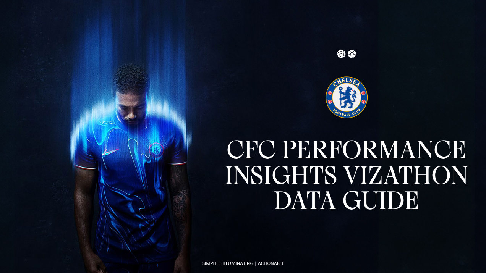

# Health Synchronization Engine  
### _The Chelsea F.C Data Vizathon Project_

---

## 🧠 Project Overview

**Health Synchronization Engine** is a Power BI dashboard developed for the **Chelsea FC Data Vizathon**, showcasing a unified view of a footballer's health and performance workload. Using **Pedro Neto** as a case example, the dashboard integrates multiple data sources to support coaching and performance staff in athlete monitoring.

### Key Features:
- **GPS Metrics**: High-speed running, acceleration loads  
- **Physical Capabilities**: Isometric and dynamic force output  
- **Recovery Monitoring**: Heart rate zone durations, musculoskeletal markers  
- **Performance Readiness**: Training vs match scenario insights  
- **Custom Tooltips**: Context-rich interactivity within visuals  
- **Data Export**: Download CSVs for deeper analysis

While the current setup focuses on Pedro Neto, the dashboard is scalable to other players. Due to licensing limitations, the dashboard functions offline within Power BI Desktop.

> Built for the **Chelsea FC Performance Analytics** team's Vizathon — a project aimed at bridging the gap between **data and decision-making** in elite football.

---

## 📁 Folder Structure

├── Datasets/ # Contains all datasets used in the project ├── Design Brief/ # Contains the pptx mockup for dashboard branding ├── Images/ # All visuals and banner images used in the project ├── Script/ # R script used to generate the Players dataset ├── Submission Documents/ # Documents submitted to Chelsea FC (Project Summary, Power BI File)

---

## 📜 License

This project is licensed under the **Apache License 2.0**.

Licensed under the Apache License, Version 2.0 (the "License"); you may not use this file except in compliance with the License. You may obtain a copy of the License at:

http://www.apache.org/licenses/LICENSE-2.0

Unless required by applicable law or agreed to in writing, software distributed under the License is distributed on an "AS IS" BASIS, WITHOUT WARRANTIES OR CONDITIONS OF ANY KIND, either express or implied. See the License for the specific language governing permissions and limitations under the License.

---

## © Copyright

**© 2025 Jeffreyjose29**  
_All rights reserved._

